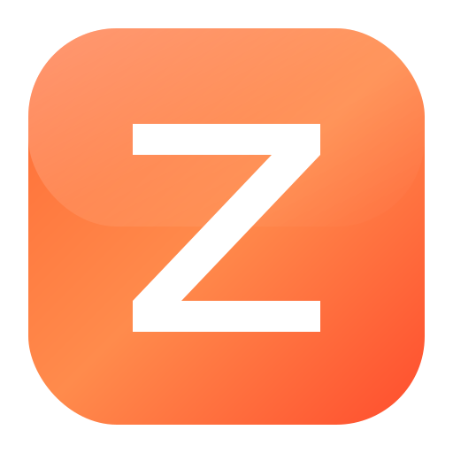

# Zarla Browser

<p align="center">
  
</p>

<h3 align="center">The Browser That Respects You</h3>

<p align="center">
  <strong>Fast. Private. Powerful.</strong><br>
  A next-gen browser built with C#, WPF & Chromium
</p>

<p align="center">
  <a href="https://github.com/xlelord9292/Zarla-Browser/releases"></a>
  
  
</p>

---

## Why Zarla?

Most browsers spy on you, slow you down, and bombard you with ads. **Zarla is different.**

- No data collection. Ever.
- Blocks ads & trackers by default
- Built-in AI assistant powered by Groq
- Create your own extensions with zero coding
- Lightweight & blazing fast

---

## Features

### Privacy & Security

| Feature | Description |
|---------|-------------|
| **Ad Blocker** | Blocks ads, popups, and annoyances out of the box |
| **Tracker Blocker** | Stops cross-site tracking and analytics |
| **Fingerprint Protection** | Randomizes your browser fingerprint |
| **Password Manager** | Secure, encrypted password storage with autofill |
| **Security Scanner** | Scans downloads for malware and threats |
| **Zero Telemetry** | We don't collect ANY data. Period. |

### AI Assistant

| Feature | Description |
|---------|-------------|
| **Built-in AI Chat** | Ask questions, get instant answers |
| **Page Summarization** | Summarize any webpage with one click |
| **Key Points Extraction** | Pull out the important info fast |
| **Web Search Integration** | AI can search the web for current info |
| **Powered by Groq** | Lightning-fast LLaMA 3 responses |

### Zarla Extensions

| Feature | Description |
|---------|-------------|
| **Block-Based Builder** | Create extensions visually - no coding needed |
| **Built-in Templates** | Cookie blocker, dark mode, YouTube enhancer & more |
| **Import/Export** | Share extensions as `.zarla` files |
| **Site-Specific** | Run extensions only on sites you choose |

**Built-in Templates:**
- Cookie Consent Blocker - Auto-dismiss annoying popups
- Dark Mode Everywhere - Force dark mode on any site
- Reading Mode - Clean, distraction-free reading
- YouTube Enhancer - Hide shorts & distracting elements
- Twitter/X Cleaner - Hide trending, "who to follow"
- Reddit Enhancer - Hide promoted posts
- Focus Mode - Hide chat widgets & notifications

### Performance

| Feature | Description |
|---------|-------------|
| **Tab Suspension** | Auto-suspends inactive tabs to save memory |
| **Smart Memory Management** | Optimizes RAM usage automatically |
| **Hardware Acceleration** | GPU-powered rendering for smooth scrolling |
| **Fast Startup** | Opens in under 2 seconds |

### Modern UI

| Feature | Description |
|---------|-------------|
| **Dark & Light Themes** | Beautiful, modern interface |
| **Tab Drag & Drop** | Reorder tabs with ease |
| **Integrated AI Panel** | Side panel that doesn't get in the way |
| **Custom New Tab** | Quick access to your favorites |

---

## Quick Start

### Download (Recommended)
Grab the latest installer from [Releases](https://github.com/xlelord9292/Zarla-Browser/releases)

### Build from Source
```powershell
git clone https://github.com/xlelord9292/Zarla-Browser.git
cd Zarla-Browser
dotnet run --project src/Zarla.Browser --framework net8.0-windows
```

---

## Keyboard Shortcuts

| Shortcut | Action |
|----------|--------|
| `Ctrl+T` | New tab |
| `Ctrl+W` | Close tab |
| `Ctrl+Tab` | Next tab |
| `Ctrl+Shift+Tab` | Previous tab |
| `Ctrl+L` | Focus address bar |
| `Ctrl+R` / `F5` | Refresh |
| `Ctrl+D` | Bookmark page |
| `Ctrl+H` | History |
| `Ctrl+J` | Downloads |
| `F12` | Developer tools |
| `Ctrl++` / `Ctrl+-` | Zoom in/out |

---

## Internal Pages

| URL | Description |
|-----|-------------|
| `zarla://newtab` | New tab page |
| `zarla://settings` | Browser settings |
| `zarla://history` | Browsing history |
| `zarla://bookmarks` | Bookmark manager |
| `zarla://downloads` | Download manager |
| `zarla://extensions` | Zarla Extensions |
| `zarla://passwords` | Password manager |
| `zarla://docs` | Documentation |

---

## Building

### Prerequisites
- **Windows 10/11** (64-bit)
- **.NET 8 SDK** - [Download](https://dotnet.microsoft.com/download/dotnet/8.0)

### Setup API Key (Required for AI Features)

To use the AI assistant and security scanning features, you need a free Groq API key:

1. Get a free API key from [Groq Console](https://console.groq.com/keys)
2. Set the environment variable:

```powershell
# Windows (PowerShell) - Permanent
[Environment]::SetEnvironmentVariable("GROQ_API_KEY", "your-api-key-here", "User")

# Or temporary (current session only)
$env:GROQ_API_KEY = "your-api-key-here"
```

### Build Commands

```powershell
# Quick build & run
dotnet run --project src/Zarla.Browser --framework net8.0-windows

# Release build
.\build.ps1 -Release

# Create installer
.\build.ps1 -Installer
```

---

## Project Structure

```
Zarla/
├── src/
│   ├── Zarla.Browser/        # Main WPF application
│   │   ├── Views/            # Settings, Extensions, Passwords
│   │   ├── Services/         # Tab manager, downloads, extensions
│   │   └── Themes/           # Dark and Light themes
│   └── Zarla.Core/           # Core library
│       ├── AI/               # AI service & usage tracking
│       ├── Privacy/          # Ad/tracker/fingerprint blocking
│       ├── Security/         # Password manager, scanner
│       ├── Extensions/       # Zarla extension system
│       └── Performance/      # Tab suspension, memory
├── assets/                   # Icons and resources
├── installer/                # NSIS installer
└── build.ps1                 # Build script
```

---

## Contributing

1. Fork the repo
2. Create your feature branch (`git checkout -b feature/cool-feature`)
3. Commit your changes (`git commit -m 'Add cool feature'`)
4. Push to the branch (`git push origin feature/cool-feature`)
5. Open a Pull Request

---

## License

MIT License - see [LICENSE](LICENSE) for details.

---

<p align="center">
  <strong>Zarla</strong><br>
  <em>Browse Fast. Browse Private. Browse Free.</em>
</p>

<p align="center">
  Made with passion for a better internet.
</p>
